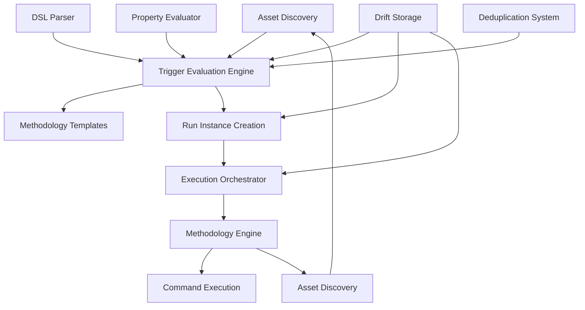
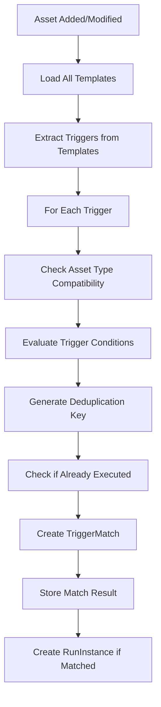
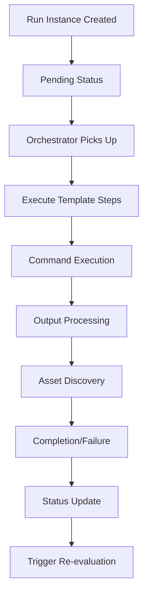
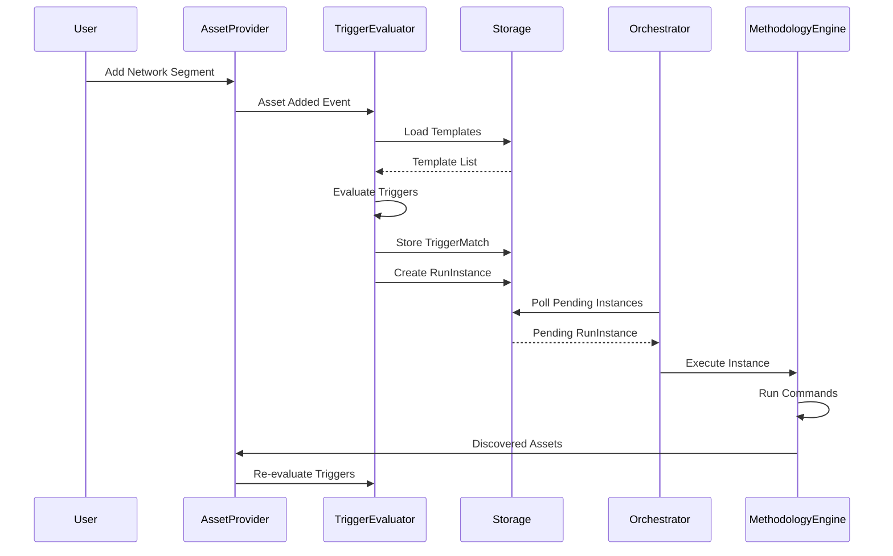

# Methodology Engine Technical Documentation

## Table of Contents

1. [Overview](#overview)
2. [System Architecture](#system-architecture)
3. [Core Components](#core-components)
4. [Asset-Property-Driven Trigger System](#asset-property-driven-trigger-system)
5. [Methodology Template System](#methodology-template-system)
6. [Trigger Evaluation Engine](#trigger-evaluation-engine)
7. [DSL and Expression System](#dsl-and-expression-system)
8. [Execution Orchestration](#execution-orchestration)
9. [Storage and State Management](#storage-and-state-management)
10. [Data Flow Architecture](#data-flow-architecture)
11. [API Reference](#api-reference)
12. [Implementation Examples](#implementation-examples)

---

## Overview

The Methodology Engine is a sophisticated attack simulation and penetration testing automation system built in Flutter/Dart. It implements an advanced asset-property-driven trigger architecture that enables realistic, non-linear attack progression based on actual reconnaissance findings rather than arbitrary completion events.

### Key Features

- **Asset-Property-Driven Triggers**: Methodologies are triggered by asset property combinations, not methodology completion
- **Intelligent Deduplication**: Prevents redundant execution using sophisticated deduplication keys
- **Batch Processing**: Combines multiple similar triggers into efficient batch operations
- **DSL Expression Engine**: Advanced trigger condition evaluation using custom DSL
- **Non-Linear Attack Graphs**: Supports parallel and conditional attack paths
- **Persistent Storage**: Complete state management using Drift database
- **Real-Time Orchestration**: Automatic and manual execution modes with live monitoring

### System Philosophy

The system transforms penetration testing from linear methodology execution into an intelligent attack orchestration platform that:

1. **Adapts to Discovered Properties**: Triggers methodologies based on actual network/asset discoveries
2. **Optimizes for Efficiency**: Batches similar operations to reduce tool invocations
3. **Prevents Redundancy**: Tracks execution history to avoid duplicate work
4. **Scales Intelligently**: Handles large networks with many similar targets
5. **Provides Realistic Progression**: Mirrors real-world penetration testing workflows

---

## System Architecture

### High-Level Architecture



### Component Layers

1. **Presentation Layer**: UI screens for managing assets, methodologies, and executions
2. **Service Layer**: Core business logic and orchestration services
3. **Model Layer**: Data models using Freezed for immutability
4. **Storage Layer**: Drift database for persistent state management
5. **Template Layer**: JSON-based methodology templates with trigger definitions

### Core File Structure

```
lib/
├── models/
│   ├── asset.dart                    # Asset models with property system
│   ├── methodology_trigger.dart      # Trigger definitions and evaluation
│   ├── run_instance.dart            # Execution tracking models
│   ├── trigger_evaluation.dart      # Trigger evaluation results
│   └── methodology.dart             # Legacy methodology models
├── services/
│   ├── methodology_engine.dart      # Core execution engine
│   ├── property_driven_engine.dart  # Property-based trigger system
│   ├── comprehensive_trigger_evaluator.dart # Advanced trigger evaluation
│   ├── methodology_execution_orchestrator.dart # Execution coordination
│   ├── trigger_dsl_parser.dart      # DSL expression parser
│   ├── methodology_loader.dart      # Template loading system
│   ├── drift_storage_service.dart   # Database operations
│   └── asset_trigger_integration_service.dart # Asset-trigger integration
├── providers/
│   ├── methodology_execution_provider.dart # State management
│   ├── comprehensive_asset_provider.dart # Asset state management
│   └── methodology_provider.dart     # Methodology state management
└── screens/
    ├── assets_screen.dart           # Asset management UI
    ├── methodology_library_screen.dart # Template browser
    └── run_dashboard_simple.dart    # Execution monitoring
```

---

## Core Components

### 1. Methodology Engine (`methodology_engine.dart`)

The central orchestration component responsible for:

- **Asset Management**: Tracking discovered assets and their properties
- **Recommendation Generation**: Suggesting methodologies based on asset properties
- **Execution Coordination**: Managing methodology step execution
- **Command Resolution**: Substituting variables in methodology commands
- **Asset Discovery**: Processing tool outputs to discover new assets

**Key Methods:**
- `addDiscoveredAsset()`: Add assets and trigger re-evaluation
- `startMethodologyExecution()`: Begin methodology execution
- `_updateRecommendations()`: Generate methodology recommendations
- `_executeStep()`: Execute individual methodology steps

### 2. Property Driven Engine (`property_driven_engine.dart`)

Implements the asset-property-driven trigger architecture:

- **Asset Property Tracking**: Monitors asset property changes
- **Trigger Detection**: Evaluates triggers against asset properties
- **Batch Processing**: Groups similar triggers for efficient execution
- **Deduplication**: Prevents redundant trigger executions

### 3. Comprehensive Trigger Evaluator (`comprehensive_trigger_evaluator.dart`)

Advanced trigger evaluation system with:

- **Complex Condition Evaluation**: DSL-based trigger conditions
- **Deduplication Key Generation**: Sophisticated key creation for tracking
- **Asset-Trigger Matching**: Intelligent matching of triggers to assets
- **Run Instance Creation**: Automatic creation of executable run instances

**Key Features:**
- Multi-level condition evaluation (simple, complex, DSL)
- Cooldown period management
- Confidence scoring
- Debug trace generation

### 4. Methodology Execution Orchestrator (`methodology_execution_orchestrator.dart`)

Handles the bridge between trigger evaluation and actual execution:

- **Auto-Execution**: Automatically picks up pending run instances
- **Concurrency Management**: Controls parallel execution limits
- **Status Monitoring**: Real-time execution status tracking
- **Manual Override**: Supports manual execution control

---

## Asset-Property-Driven Trigger System

### Core Concept

Instead of linear methodology chains, the system uses asset properties to trigger workflows dynamically:

```yaml
# Traditional Approach (Linear)
Methodology A completes → Trigger Methodology B → Trigger Methodology C

# Asset-Property Approach (Dynamic)
Asset has NAC enabled + Credentials available → Trigger NAC Bypass
Asset has Web Services + SMB Signing disabled → Trigger SMB Relay
Asset has Domain Name discovered → Trigger Responder Attack (parallel)
```

### Asset Property System

Assets have rich, evolving properties that drive methodology selection:

```dart
// Network Segment Asset Example
Map<String, PropertyValue> properties = {
  'access_level': PropertyValue.string('blocked'),
  'nac_enabled': PropertyValue.boolean(true),
  'domain_name': PropertyValue.string('corp.local'),
  'live_hosts': PropertyValue.stringList(['192.168.1.10', '192.168.1.20']),
  'web_services': PropertyValue.objectList([
    {'host': '192.168.1.10', 'port': 80, 'service': 'nginx'},
    {'host': '192.168.1.20', 'port': 443, 'service': 'apache'}
  ]),
  'captured_hashes': PropertyValue.stringList([]),
  'smb_signing': PropertyValue.boolean(false),
};
```

### Trigger Definition Structure

Triggers are defined with sophisticated condition matching:

```dart
MethodologyTrigger(
  id: 'nac_credential_testing',
  assetType: AssetType.networkSegment,
  conditions: TriggerConditionGroup(
    operator: LogicalOperator.and,
    conditions: [
      TriggerCondition(
        property: 'nac_enabled',
        operator: TriggerOperator.equals,
        value: true,
      ),
      TriggerCondition(
        property: 'credentials_available',
        operator: TriggerOperator.exists,
      ),
      TriggerCondition(
        property: 'access_level',
        operator: TriggerOperator.inList,
        value: ['blocked', 'limited'],
      ),
    ],
  ),
  deduplicationKeyTemplate: '{asset.id}:nac_cred:{credentials_hash}',
  batchCapable: true,
  priority: 5,
);
```

### Deduplication Strategy

The system prevents redundant executions using sophisticated deduplication:

1. **Key Generation**: Creates unique keys based on asset properties and methodology
2. **Cooldown Periods**: Prevents re-execution within specified timeframes
3. **Result Tracking**: Stores execution results for audit and optimization
4. **Batch Grouping**: Groups similar triggers to optimize execution

**Deduplication Key Templates:**
```dart
// Simple asset-based deduplication
'{asset.id}:{methodology.id}'

// Property-based deduplication
'{asset.id}:web_enum:{web_services.length}'

// Hash-based for complex properties
'{asset.id}:{methodology.id}:{hash}'

// Time-based deduplication
'{asset.id}:{methodology.id}:{date}'
```

### Batch Processing

Multiple similar triggers are automatically combined into efficient batch operations:

```dart
// Individual Triggers:
// - Scan web service 192.168.1.10:80
// - Scan web service 192.168.1.20:443
// - Scan web service 192.168.1.30:8080

// Batch Command Generated:
echo "http://192.168.1.10:80" > /tmp/web_targets.txt
echo "https://192.168.1.20:443" >> /tmp/web_targets.txt
echo "http://192.168.1.30:8080" >> /tmp/web_targets.txt

eyewitness --web -f /tmp/web_targets.txt -d /tmp/screenshots
parallel -j 4 "nikto -h {}" :::: /tmp/web_targets.txt
```

---

## Methodology Template System

### Template Structure

Methodologies are defined as JSON templates with standardized structure:

```json
{
  "id": "nac_bypass_comprehensive",
  "version": "1.0.0",
  "template_version": "1.0",
  "name": "Comprehensive NAC Bypass Methodology",
  "workstream": "network_segregation",
  "description": "...",
  "tags": ["nac", "network", "bypass"],
  "risk_level": "medium",

  "overview": {
    "purpose": "...",
    "scope": "...",
    "prerequisites": [],
    "category": "Network Access Control Testing"
  },

  "triggers": [
    {
      "name": "physical_network_access",
      "type": "simple",
      "conditions": {
        "asset_type": "networkSegment",
        "properties": {
          "nac_enabled": true,
          "access_level": "blocked"
        }
      },
      "description": "Trigger when NAC is present and initial access is blocked"
    }
  ],

  "procedures": [
    {
      "id": "dhcp_autoconfiguration",
      "name": "DHCP Auto-Configuration",
      "description": "...",
      "risk_level": "low",
      "commands": [
        {
          "tool": "dhclient",
          "command": "sudo dhclient -v {interface}",
          "description": "Request DHCP configuration on Linux",
          "parameters": {
            "interface": "Network interface name"
          },
          "platforms": ["linux"]
        }
      ]
    }
  ],

  "findings": [],
  "cleanup": [],
  "troubleshooting": []
}
```

### Template Loading System

The `MethodologyLoader` service handles template management:

```dart
class MethodologyLoader {
  // Load all methodologies from assets
  static Future<Map<String, List<MethodologyTemplate>>> loadAllMethodologies()

  // Get methodology by ID
  static MethodologyTemplate? getMethodologyById(String id)

  // Search methodologies by criteria
  static List<MethodologyTemplate> searchMethodologies({
    String? query,
    String? workstream,
    List<String>? tags,
    String? riskLevel,
  })
}
```

### Template Categories

Templates are organized by workstream:

- **discovery/**: Network and service discovery methodologies
- **network_segregation/**: NAC bypass and network penetration
- **breakout/**: Container and environment breakout techniques
- **exploitation/**: Service exploitation methodologies
- **post_exploitation/**: Privilege escalation and persistence

---

## Trigger Evaluation Engine

### Evaluation Process

The trigger evaluation follows a multi-stage process:



### Condition Evaluation

The system supports multiple condition evaluation methods:

#### 1. Simple Object Conditions

```json
{
  "asset_type": "networkSegment",
  "properties": {
    "nac_enabled": true,
    "access_level": "blocked"
  }
}
```

#### 2. Complex Logical Conditions

```json
{
  "and": [
    {"property": "nac_enabled", "operator": "equals", "value": true},
    {"property": "credentials_available", "operator": "exists"},
    {
      "or": [
        {"property": "access_level", "operator": "equals", "value": "blocked"},
        {"property": "access_level", "operator": "equals", "value": "limited"}
      ]
    }
  ]
}
```

#### 3. DSL String Expressions

```javascript
"nac_enabled = true AND credentials_available.length > 0"
"web_services.length > 0 OR (smb_hosts.length > 0 AND smb_signing = false)"
"domain_name exists AND captured_hashes.length = 0"
```

### Trigger Matching Logic

```dart
class ComprehensiveTriggerEvaluator {
  Future<List<TriggerMatch>> evaluateAsset(Asset asset) async {
    final templates = await _storage.getAllTemplates();
    final results = <TriggerMatch>[];

    for (final template in templates) {
      for (final trigger in template.triggers) {
        // Check asset type compatibility
        if (!_isAssetTypeCompatible(trigger, asset)) continue;

        // Generate deduplication key
        final dedupKey = _generateDeduplicationKey(trigger, asset, template);

        // Check if already executed recently
        if (await _isDeduplicationKeyUsed(dedupKey, trigger)) continue;

        // Evaluate trigger conditions
        final match = await _evaluateTrigger(trigger, asset, template);

        if (match != null && match.matched) {
          // Store successful match and create run instance
          await _storage.storeTriggerMatch(match, _projectId);
          await _createRunInstance(trigger, asset, template, match);
          results.add(match);
        }
      }
    }

    return results;
  }
}
```

---

## DSL and Expression System

### DSL Parser Architecture

The `TriggerDslParser` provides advanced expression evaluation:

```dart
class TriggerDslParser {
  static TriggerConditionResult evaluateExpression(
    String expression,
    Map<String, PropertyValue> assetProperties,
  ) {
    // 1. Tokenize expression
    final tokens = _tokenize(expression);

    // 2. Parse tokens into expression tree
    final result = _parseTokens(tokens, assetProperties, variables, debugTrace);

    // 3. Return detailed result with debug information
    return TriggerConditionResult(
      expression: expression,
      result: result,
      variables: variables,
      executionTimeMs: executionTime,
      debugTrace: debugTrace,
    );
  }
}
```

### Supported Operators

| Operator | Description | Example |
|----------|-------------|---------|
| `=`, `==` | Equality | `nac_enabled = true` |
| `!=` | Inequality | `access_level != "full"` |
| `>`, `<` | Comparison | `web_services.length > 0` |
| `>=`, `<=` | Comparison | `priority >= 5` |
| `contains` | String/List contains | `domain_name contains "corp"` |
| `exists` | Property exists | `captured_hashes exists` |
| `not_exists` | Property doesn't exist | `admin_access not_exists` |
| `AND`, `&&` | Logical AND | `A AND B` |
| `OR`, `\|\|` | Logical OR | `A OR B` |

### Property Access Patterns

The DSL supports sophisticated property access:

```javascript
// Basic property access
"nac_enabled = true"

// Property with dot notation
"credentials_available.length > 0"
"web_services.contains('nginx')"

// Complex expressions
"(nac_enabled = true AND credentials_available.length > 0) OR web_services.length > 5"

// Function-style access
"domain_name.contains('corp') AND smb_signing = false"
```

### Expression Builder Helpers

Pre-built expression builders for common patterns:

```dart
class TriggerExpressionBuilder {
  static String assetHasProperty(String property) =>
    '$property exists';

  static String assetPropertyEquals(String property, dynamic value) =>
    '$property = $value';

  static String assetListNotEmpty(String listProperty) =>
    '$listProperty.length > 0';

  static String andCondition(String left, String right) =>
    '($left) AND ($right)';

  static String nacEnabledWithCredentials() =>
    andCondition(
      assetPropertyEquals('nac_enabled', true),
      assetListNotEmpty('credentials_available'),
    );
}
```

---

## Execution Orchestration

### Orchestrator Architecture

The `MethodologyExecutionOrchestrator` manages the execution pipeline:

```dart
class MethodologyExecutionOrchestrator {
  // Core orchestration loop
  Future<void> _orchestrationLoop() async {
    while (_isRunning) {
      if (_autoExecuteEnabled) {
        // Get pending run instances
        final pendingInstances = await _storage.getRunInstancesByStatus(
          _projectId,
          RunInstanceStatus.pending
        );

        // Execute up to concurrency limit
        final availableSlots = _maxConcurrentExecutions - _activeExecutions.length;
        final instancesToExecute = pendingInstances.take(availableSlots);

        for (final instance in instancesToExecute) {
          _executeRunInstance(instance);
        }
      }

      await Future.delayed(const Duration(seconds: 10));
    }
  }
}
```

### Execution Lifecycle



### Execution Modes

1. **Automatic Mode**: Orchestrator continuously picks up pending run instances
2. **Manual Mode**: User explicitly executes specific run instances
3. **Hybrid Mode**: Automatic with manual override capabilities

### Concurrency Management

```dart
class ExecutionConcurrency {
  int maxConcurrentExecutions = 3;
  final Map<String, Future<void>> _activeExecutions = {};

  Future<void> executeWithLimit(String id, Future<void> Function() execution) async {
    while (_activeExecutions.length >= maxConcurrentExecutions) {
      await Future.any(_activeExecutions.values);
    }

    _activeExecutions[id] = execution().whenComplete(() {
      _activeExecutions.remove(id);
    });
  }
}
```

---

## Storage and State Management

### Database Schema (Drift)

The system uses Drift for type-safe database operations:

```dart
// Core tables
class MethodologyTemplatesTable extends Table {
  TextColumn get id => text()();
  TextColumn get version => text()();
  TextColumn get name => text()();
  TextColumn get workstream => text()();
  // ... additional columns
}

class RunInstancesTable extends Table {
  TextColumn get runId => text()();
  TextColumn get projectId => text()();
  TextColumn get templateId => text()();
  TextColumn get status => text()();
  DateTimeColumn get createdAt => dateTime()();
  // ... additional columns
}

class TriggerMatchesTable extends Table {
  TextColumn get id => text()();
  TextColumn get triggerId => text()();
  TextColumn get assetId => text()();
  BoolColumn get matched => boolean()();
  // ... additional columns
}
```

### State Management with Riverpod

The application uses Riverpod for reactive state management:

```dart
// Asset Provider
final assetProvider = StateNotifierProvider<AssetNotifier, List<Asset>>((ref) {
  return AssetNotifier();
});

// Methodology Execution Provider
final methodologyExecutionProvider =
  StateNotifierProvider<MethodologyExecutionNotifier, MethodologyExecutionState>((ref) {
    return MethodologyExecutionNotifier();
  });

// Storage Provider
final storageProvider = Provider<DriftStorageService>((ref) {
  return DriftStorageService(ref.read(databaseProvider));
});
```

### Data Persistence Strategy

1. **Templates**: Loaded from JSON assets, cached in database
2. **Run Instances**: Fully persisted with complete execution history
3. **Trigger Matches**: Stored for deduplication and analytics
4. **Asset Properties**: Cached in memory, persisted on changes
5. **Execution Results**: Stored with complete command outputs and discoveries

---

## Data Flow Architecture

### Complete System Flow



### Event-Driven Updates

The system uses reactive programming patterns:

```dart
// Asset changes trigger re-evaluation
class AssetProvider extends StateNotifier<List<Asset>> {
  void addAsset(Asset asset) {
    state = [...state, asset];

    // Trigger evaluation for new asset
    ref.read(triggerEvaluatorProvider).evaluateAsset(asset);
  }

  void updateAssetProperties(String assetId, Map<String, PropertyValue> properties) {
    final updatedAssets = state.map((asset) {
      return asset.id == assetId
        ? asset.copyWith(properties: properties)
        : asset;
    }).toList();

    state = updatedAssets;

    // Re-evaluate triggers for updated asset
    final updatedAsset = updatedAssets.firstWhere((a) => a.id == assetId);
    ref.read(triggerEvaluatorProvider).evaluateAsset(updatedAsset);
  }
}
```

---

## API Reference

### Core Service APIs

#### MethodologyEngine

```dart
class MethodologyEngine {
  // Asset management
  void addDiscoveredAsset(String projectId, DiscoveredAsset asset);
  void addDiscoveredAssets(String projectId, List<DiscoveredAsset> assets);
  List<DiscoveredAsset> getProjectAssets(String projectId);

  // Execution management
  Future<MethodologyExecution> startMethodologyExecution(
    String projectId,
    String methodologyId,
    {Map<String, dynamic>? additionalContext}
  );

  MethodologyExecution? getExecution(String executionId);

  // Recommendations
  List<MethodologyRecommendation> get recommendations;
  void suppressRecommendation(String recommendationId, String reason);

  // Streams
  Stream<List<MethodologyExecution>> get executionsStream;
  Stream<List<MethodologyRecommendation>> get recommendationsStream;
  Stream<List<DiscoveredAsset>> get assetsStream;
}
```

#### ComprehensiveTriggerEvaluator

```dart
class ComprehensiveTriggerEvaluator {
  // Constructor
  ComprehensiveTriggerEvaluator({
    required DriftStorageService storage,
    required String projectId,
  });

  // Core evaluation methods
  Future<List<TriggerMatch>> evaluateAsset(Asset asset);
  Future<Map<String, List<TriggerMatch>>> evaluateAllAssets();
  Future<List<TriggerMatch>> evaluateTriggerAcrossAssets(
    MethodologyTrigger trigger,
    MethodologyTemplate template,
  );

  // Statistics and management
  Future<Map<String, dynamic>> getEvaluationStats();
  Future<void> cleanupOldData({Duration? maxAge});
}
```

#### DriftStorageService

```dart
class DriftStorageService {
  // Template management
  Future<void> storeTemplate(MethodologyTemplate template);
  Future<MethodologyTemplate?> getTemplate(String id);
  Future<List<MethodologyTemplate>> getAllTemplates();
  Future<void> deleteTemplate(String id);

  // Run instance management
  Future<void> storeRunInstance(RunInstance runInstance, String projectId);
  Future<RunInstance?> getRunInstance(String runId);
  Future<List<RunInstance>> getAllRunInstances(String projectId);
  Future<List<RunInstance>> getRunInstancesByStatus(String projectId, RunInstanceStatus status);
  Future<void> updateRunInstance(RunInstance runInstance, String projectId);

  // History tracking
  Future<void> storeHistoryEntry(HistoryEntry entry, String runId);
  Future<List<HistoryEntry>> getHistoryForRunInstance(String runId);

  // Trigger management
  Future<void> storeTriggerMatch(TriggerMatch match, String projectId);
  Future<List<TriggerMatch>> getSuccessfulMatches(String projectId);
}
```

#### TriggerDslParser

```dart
class TriggerDslParser {
  // Main evaluation method
  static TriggerConditionResult evaluateExpression(
    String expression,
    Map<String, PropertyValue> assetProperties,
  );
}

class TriggerExpressionBuilder {
  // Helper methods for building expressions
  static String assetHasProperty(String property);
  static String assetPropertyEquals(String property, dynamic value);
  static String assetPropertyContains(String property, String value);
  static String assetListNotEmpty(String listProperty);
  static String andCondition(String left, String right);
  static String orCondition(String left, String right);
}
```

---

## Implementation Examples

### 1. Creating a Custom Methodology Template

```json
{
  "id": "custom_web_enumeration",
  "version": "1.0.0",
  "template_version": "1.0",
  "name": "Custom Web Service Enumeration",
  "workstream": "enumeration",
  "author": "Security Team",
  "created": "2024-01-15T00:00:00Z",
  "modified": "2024-01-15T00:00:00Z",
  "status": "active",
  "description": "Comprehensive web service enumeration and vulnerability scanning",
  "tags": ["web", "enumeration", "scanning"],
  "risk_level": "low",

  "triggers": [
    {
      "name": "web_services_detected",
      "type": "complex",
      "conditions": {
        "expression": "web_services.length > 0 AND access_level != 'blocked'"
      },
      "description": "Trigger when web services are discovered and accessible"
    }
  ],

  "procedures": [
    {
      "id": "web_technology_detection",
      "name": "Web Technology Detection",
      "description": "Identify web technologies and frameworks",
      "risk_level": "low",
      "commands": [
        {
          "tool": "whatweb",
          "command": "whatweb {web_url} --aggression 3",
          "description": "Detect web technologies",
          "parameters": {
            "web_url": "Target web service URL"
          }
        }
      ]
    }
  ]
}
```

### 2. Adding Assets with Property-Driven Triggers

```dart
// Add a network segment with NAC
final networkSegment = Asset(
  id: 'network_corp_main',
  name: 'Corporate Main Network',
  type: AssetType.networkSegment,
  projectId: projectId,
  properties: {
    'subnet': PropertyValue.string('192.168.100.0/24'),
    'nac_enabled': PropertyValue.boolean(true),
    'access_level': PropertyValue.string('blocked'),
    'barriers': PropertyValue.stringList(['nacEnabled', 'firewallRules']),
  },
);

// Add the asset - this will automatically trigger evaluation
await assetProvider.addAsset(networkSegment);

// Later, update properties to trigger new methodologies
await assetProvider.updateAssetProperties('network_corp_main', {
  'access_level': PropertyValue.string('partial'),
  'live_hosts': PropertyValue.stringList(['192.168.100.10', '192.168.100.20']),
  'web_services': PropertyValue.objectList([
    {'host': '192.168.100.10', 'port': 80, 'service': 'nginx'},
    {'host': '192.168.100.20', 'port': 443, 'service': 'apache'},
  ]),
});
```

### 3. Custom DSL Expressions

```dart
// Complex trigger conditions using DSL
final triggerExpressions = [
  // NAC bypass opportunity
  "nac_enabled = true AND credentials_available.length > 0",

  // Web service enumeration
  "web_services.length > 0 AND access_level != 'blocked'",

  // SMB relay attack opportunity
  "smb_hosts.length > 0 AND smb_signing = false AND captured_hashes.length > 0",

  // Responder attack conditions
  "domain_name exists AND captured_hashes.length = 0",

  // Multi-condition complex trigger
  "(nac_enabled = true OR firewall_enabled = true) AND " +
  "(credentials_available.length > 0 OR web_services.length > 3)",
];

// Evaluate expressions
for (final expression in triggerExpressions) {
  final result = TriggerDslParser.evaluateExpression(expression, asset.properties);
  print('Expression: $expression');
  print('Result: ${result.result}');
  print('Variables: ${result.variables}');
  print('Debug: ${result.debugTrace}');
}
```

### 4. Manual Execution Control

```dart
// Get the orchestrator
final orchestrator = ref.read(methodologyExecutionProvider.notifier);

// Start automatic execution
await orchestrator.startOrchestrator();
orchestrator.setAutoExecuteEnabled(true);
orchestrator.setMaxConcurrentExecutions(5);

// Manual execution of specific run instance
final runInstance = await storage.getRunInstance('run_123');
if (runInstance != null) {
  await orchestrator.executeRunInstance(runInstance);
}

// Monitor execution status
orchestrator.statusStream.listen((status) {
  print('Orchestrator Status: ${status.isRunning}');
  print('Active Executions: ${status.activeExecutions}');
  print('Pending Instances: ${status.pendingInstances}');
});
```

### 5. Creating Custom Triggers

```dart
// Define a custom trigger for privilege escalation
final privilegeEscalationTrigger = MethodologyTrigger(
  id: 'privilege_escalation_opportunity',
  methodologyId: 'linux_privesc_comprehensive',
  name: 'Linux Privilege Escalation Opportunity',
  assetType: AssetType.host,
  conditions: TriggerConditionGroup(
    operator: LogicalOperator.and,
    conditions: [
      TriggerCondition(
        property: 'operating_system',
        operator: TriggerOperator.contains,
        value: 'linux',
      ),
      TriggerCondition(
        property: 'shell_access',
        operator: TriggerOperator.equals,
        value: true,
      ),
      TriggerCondition(
        property: 'privilege_level',
        operator: TriggerOperator.equals,
        value: 'user',
      ),
    ],
  ),
  deduplicationKeyTemplate: '{asset.id}:privesc:{user_context}',
  cooldownPeriod: Duration(hours: 6),
  batchCapable: false,
  priority: 8,
  enabled: true,
  tags: ['privilege_escalation', 'linux', 'post_exploitation'],
);
```

---

This documentation provides a comprehensive technical overview of the Methodology Engine, covering its architecture, components, and implementation details. The system represents a sophisticated approach to penetration testing automation that moves beyond traditional linear methodology execution to embrace dynamic, property-driven attack simulation.